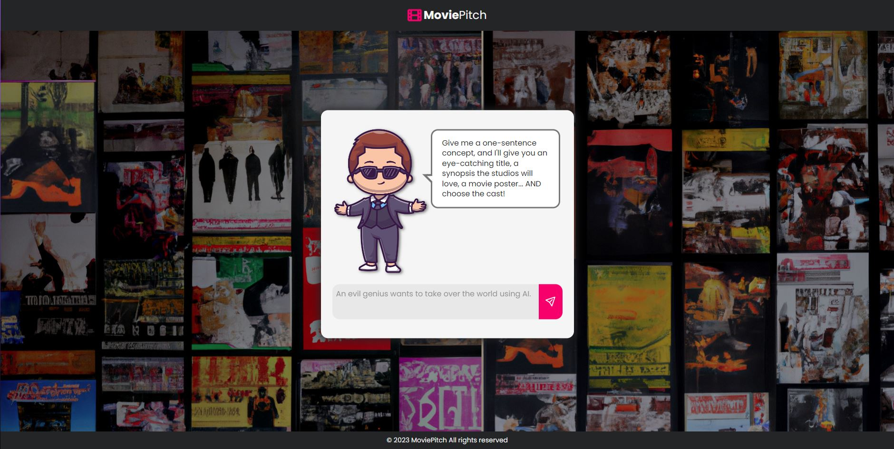

# MoviePitch - AI Movie Idea Generator

## Overview

MoviePitch is an AI-powered application that transforms a simple one-sentence idea into a full-fledged movie concept complete with a synopsis, title, cast, and cover art. This project leverages the capabilities of the OpenAI API, integrating both ChatGPT for text generation and DALL-E for image creation.

In this project, we explore the capabilities of the OpenAI API, utilizing advanced models such as `text-davinci-003` and `DALL-E`. The application employs various approaches, including the Zero-Shot and Few-Shot techniques, to enhance the quality and diversity of the generated content.

## Technologies Used

- **Vue.js:** The frontend of the application is built using Vue.js, a progressive JavaScript framework.
- **Vite**: A build tool that enhances the development experience for Vue.js applications.
- **OpenAI API:** The backbone of the project, providing powerful AI models for natural language understanding and image generation.

## OpenAI API Details

- **Models Used**: `text-davinci-003` for text-based prompts and `DALL-E` for image generation.
- **Endpoints Utilized**:
  - **createCompletion**: Used for generating responses to text prompts.
  - **createImage**: Employed for creating images based on textual descriptions.
- **Approaches**:
  - **Zero Shot**: Leveraged to handle a wide range of prompts without explicit training.
  - **Few Shot**: Applied to provide the model with a small set of examples to improve understanding.
- **Parameters**:
  - **max_tokens**: Adjusted to control the length of the generated text.
  - **temperature**: Tuned to control the randomness of the model's output.

## Lessons Learned

Throughout the development of MoviePitch, several key lessons were learned:

1. **API Integration:** Understanding and effectively integrating external APIs, such as the OpenAI API, into a project.
2. **Vue.js Fundamentals:** Deepening knowledge of Vue.js, including components, data binding, and reactivity.
3. **Asynchronous Operations:** Handling asynchronous operations gracefully, especially when making API calls.
4. **Error Handling:** Implementing robust error handling mechanisms to enhance the application's reliability.

## Ideas to Make It Better

To enhance MoviePitch further, consider the following ideas:

1. Implement user accounts to save and revisit generated movie ideas.
2. Allow users to provide feedback on generated content to improve AI model training.
3. Explore additional OpenAI models for even more creative outputs.
4. Enhance the user interface and experience.
5. Implement user authentication for personalized experiences.
6. Optimize and refactor code for better performance.

## Getting Started

To run MoviePitch locally, follow these steps:

1. Clone the repository: `git clone https://github.com/yourusername/MoviePitch.git`
2. Install dependencies: `npm install`
3. Configure the OpenAI API key in the project.
4. Run the application: `npm run dev`

## Acknowledgments

Special thanks to Scrimba for offering the course by Tom Chant, which inspired and guided the development of this project.

## Contributing

If you'd like to contribute to MoviePitch, please fork the repository and create a pull request. Feedback and suggestions are also welcome!

## License

This project is licensed under the [MIT License](LICENSE).
