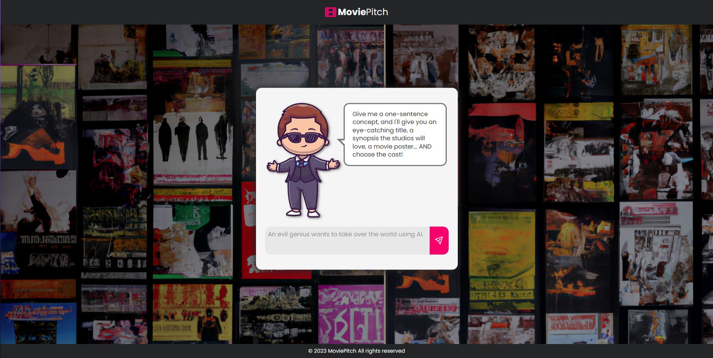

# MoviePitch - AI Movie Idea Generator

## Overview

MoviePitch turns a one-sentence idea into a full movie concept — a title, a synopsis, a cast, and AI-generated cover art — in seconds.

The app is scoped on purpose: it's not a general-purpose chatbot wearing a movie-themed skin. A guarded backend prompt evaluates every submission and only ever produces a movie pitch (or a friendly redirect if the input isn't one), no matter how the input is phrased.

**Live demo:** [[moviepitch-shemmee.vercel.app](https://moviepitch-shemmee.vercel.app/)]



## How It Works

1. You type a one-sentence movie idea.
2. A backend function sends it to Google's Gemini API with a system prompt that treats your idea strictly as *data to evaluate*, never as instructions — and returns a structured JSON pitch (title, synopsis, cast, a reaction from "Movie Boss," and an image prompt).
3. If the input isn't actually a movie idea, the API flags it and the app shows a short in-character redirect instead of generating a pitch.
4. A second backend function sends the image prompt to Cloudflare Workers AI (running FLUX.1 Schnell) to generate the poster.

## Technologies Used

- **Vue 3 + Vite** — frontend, split into a form component, a result component, and a shared composable holding state and API calls.
- **Vercel Serverless Functions** — the backend layer (`/api`). API keys and prompts live here only; nothing sensitive ships to the browser.
- **Google Gemini API** (`gemini-3.6-flash`) — structured-output text generation for the pitch itself.
- **Cloudflare Workers AI** (FLUX.1 Schnell) — poster image generation.

Both AI providers run on free tiers with no ongoing cost to run the project.

## Project Structure

```
MoviePitch
├─ api/
│  ├─ generate-pitch.js      # Gemini call + scope guardrail + structured JSON
│  └─ generate-image.js      # Cloudflare Workers AI call
├─ lib/
│  └─ gemini.js               # Shared client, system prompt, JSON schema
├─ src/
│  ├─ components/
│  │  ├─ MoviePitch.vue       # Thin container, switches form/result
│  │  ├─ PitchForm.vue        # Idea input + Movie Boss reaction
│  │  └─ PitchResult.vue      # Poster, title, cast, synopsis
│  └─ composables/
│     └─ useMoviePitch.js     # Shared state + fetch logic (singleton)
└─ vite.config.js
```

## Scope & Safety Design

The single most important design decision in this project: **the AI is not allowed to be a general chatbot.** This is enforced server-side, not in the UI:

- The system prompt instructs the model to treat the submitted text only as a *candidate movie idea*, never as instructions — even if it's phrased as a command or a request to change the model's behavior.
- The model returns an `isValidPitch` flag as part of a strict JSON schema. Off-topic input gets a short in-character decline, never compliance.
- The image generation step only ever runs on a prompt the backend itself produced from a validated pitch — never on raw user text — closing off a path where someone could smuggle instructions straight into the image prompt.
- API keys are never exposed to the browser; all model calls happen inside Vercel serverless functions.

## Getting Started

1. Clone the repository:
   ```
   git clone https://github.com/s-shemmee/MoviePitch.git
   cd MoviePitch
   npm install
   ```
2. Get a free Gemini API key at [aistudio.google.com/apikey](https://aistudio.google.com/apikey).
3. Get free Cloudflare Workers AI credentials at [dash.cloudflare.com](https://dash.cloudflare.com) — you'll need your Account ID and an API Token scoped to Workers AI.
4. Copy `.env.example` to `.env` and fill in:
   ```
   GEMINI_API_KEY=...
   CLOUDFLARE_ACCOUNT_ID=...
   CLOUDFLARE_API_TOKEN=...
   ```
5. Run locally with the Vercel CLI (plain `vite`/`npm run dev` won't serve the `/api` functions):
   ```
   npm install -g vercel
   vercel link
   vercel dev
   ```

## Lessons Learned

- **Free AI tiers move fast.** Model availability and quotas for both text and image generation changed multiple times over the course of building this — the architecture (isolated backend functions per provider) made swapping providers a contained change rather than a rewrite.
- **Scoping an AI feature is a backend problem, not a prompt-wording problem.** Structured output plus explicitly telling the model to treat user input as data rather than instructions did more than any amount of "please only talk about movies" phrasing alone.
- **Serverless functions need their own local dev flow.** `vite dev` and `vercel dev` are not interchangeable — only the latter serves `/api` routes locally.

## Ideas to Make It Better

1. Basic per-IP rate limiting on the API routes, since the public demo currently shares one set of API keys across all visitors.
2. Let users save and revisit past pitches.
3. Add a "regenerate poster" option without regenerating the whole pitch.
4. Optional Bring-Your-Own-Key mode for visitors who want to remove the shared rate limit entirely.

## Acknowledgments

Originally inspired by a Scrimba course by Tom Chant; substantially rebuilt since with a new backend architecture, current-generation AI providers, and scope-restriction guardrails.

## Contributing

Forks and pull requests are welcome — feedback and suggestions too.

## License

This project is licensed under the [MIT License](LICENSE).